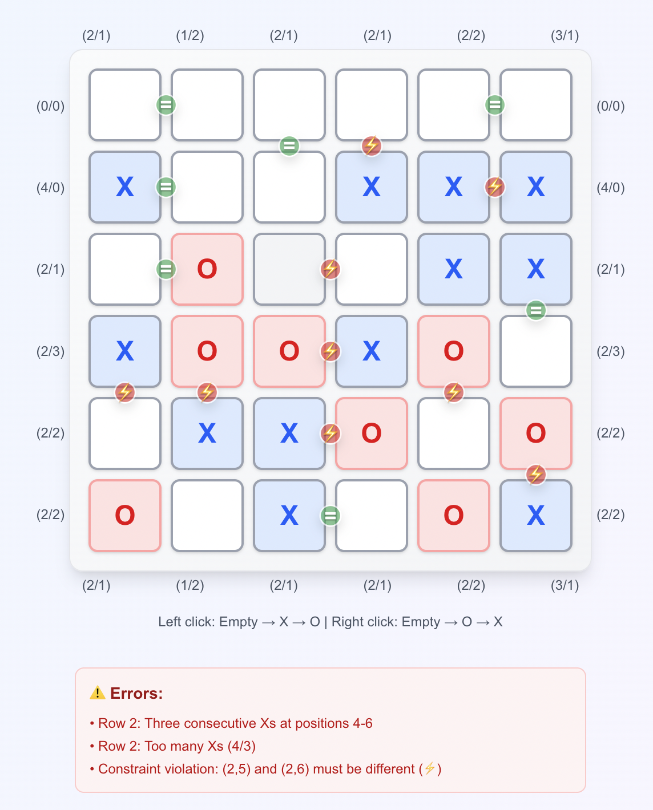
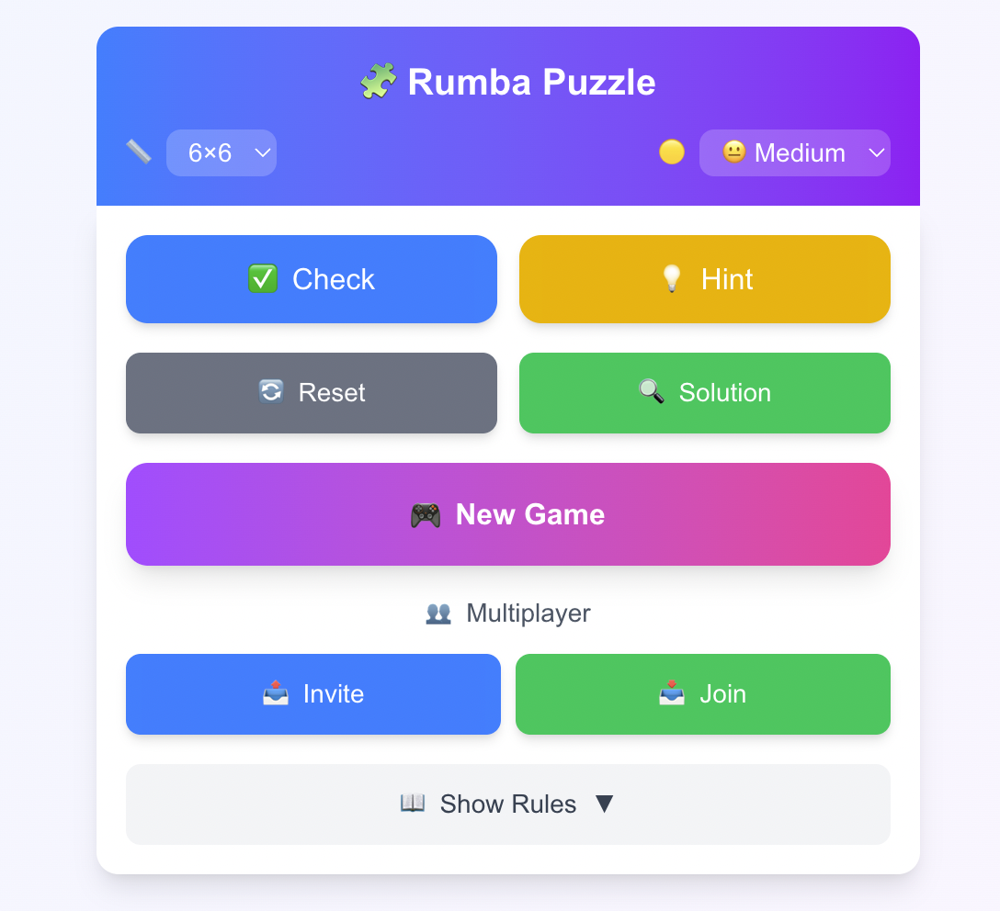

# 🎮 Rumba Puzzle Game

Rumba là một game puzzle logic tương tự Takuzu/Binairo, nơi người chơi phải điền các ký tự X và O vào bảng lưới theo các quy tắc nghiêm ngặt. Game hỗ trợ chơi đơn và chế độ multiplayer realtime với tính điểm dựa trên thời gian.

## 📸 Screenshots

### Giao diện Game Board

*Giao diện bảng chơi 6x6 với hệ thống validation và hiển thị lỗi realtime*

### Giao diện Điều khiển

*Giao diện điều khiển game với các tùy chọn kích thước, độ khó và chế độ multiplayer*

## ✨ Tính năng

### Quy tắc Game
- **Cân bằng ký tự**: Mỗi hàng và cột phải có số lượng X và O bằng nhau (N/2 mỗi loại)
- **Không 3 liên tiếp**: Không được có 3 ký tự giống nhau liền nhau theo hàng hoặc cột
- **Tính duy nhất**: Không có hai hàng hoặc cột nào trùng hệt nhau
- **Hoàn thành**: Game kết thúc khi toàn bộ bảng hợp lệ và không còn ô trống

### Tính năng Game
- 🎯 **Nhiều kích thước**: Hỗ trợ bảng 4×4, 6×6, 8×8
- 🎨 **Tương tác trực quan**: 
  - Click trái: Trống → X → O
  - Click phải: Trống → O → X
- ✅ **Validation realtime**: Kiểm tra lỗi ngay khi người chơi điền
- 💡 **Hint system**: Gợi ý giúp người chơi khi gặp khó khăn
- 🔄 **Reset & Solution**: Khôi phục hoặc xem đáp án
- ⏱️ **Tính điểm theo thời gian**: Hoàn thành càng nhanh, điểm càng cao

### Multiplayer
- 🌐 **Realtime multiplayer**: Chơi cùng bạn bè qua WebSocket
- 👥 **Invite & Join**: Mời người chơi hoặc tham gia game
- 🔄 **Đồng bộ realtime**: Tất cả người chơi thấy nước đi của nhau ngay lập tức
- 🏆 **So sánh thời gian**: Người chơi nhanh nhất thắng

## 🛠️ Công nghệ

### Frontend
- **React 19** + **Next.js 15** - Framework UI hiện đại
- **TailwindCSS 4** - Styling utility-first
- **Socket.io Client** - Kết nối WebSocket realtime
- **TypeScript** - Type safety

### Backend
- **NestJS 11** - Framework Node.js enterprise-grade
- **TypeORM** - ORM cho database
- **SQLite** - Database nhẹ, phù hợp MVP
- **Socket.io** - WebSocket server cho multiplayer
- **JWT** - Authentication và authorization
- **Passport** - Authentication middleware

### Infrastructure
- **Docker Compose** - Containerization và orchestration
- **Nginx** - Reverse proxy và load balancing

## 🚀 Cài đặt và Chạy

### Yêu cầu
- Node.js >= 18
- Docker & Docker Compose
- npm hoặc yarn

### Cài đặt

1. **Clone repository**
```bash
git clone <repository-url>
cd rumba-multiplayer
```

2. **Cài đặt dependencies**

Frontend:
```bash
cd rumba-frontend
npm install
```

Backend:
```bash
cd rumba-backend
npm install
```

3. **Chạy với Docker Compose** (Khuyến nghị)
```bash
docker-compose up -d
```

Sau khi chạy:
- Frontend: http://localhost:3000
- Backend API: http://localhost:3005
- Nginx: http://localhost:80

### Development

**Frontend:**
```bash
cd rumba-frontend
npm run dev
```

**Backend:**
```bash
cd rumba-backend
npm run start:dev
```

## 📁 Cấu trúc Dự án

```
rumba-multiplayer/
├── rumba-frontend/          # Next.js frontend
│   ├── app/                # Next.js app router
│   ├── components/         # React components
│   │   ├── GameBoard.tsx   # Bảng chơi chính
│   │   ├── GameControls.tsx # Các nút điều khiển
│   │   └── ...
│   ├── hooks/              # Custom React hooks
│   │   ├── useGame.ts      # Game logic hook
│   │   └── useMultiplayer.ts # Multiplayer hook
│   └── lib/                # Utilities
│       ├── game-logic.ts    # Core game algorithms
│       └── puzzle-generator.ts # Puzzle generation
│
├── rumba-backend/          # NestJS backend
│   ├── src/
│   │   ├── games/          # Game module
│   │   ├── users/          # User authentication
│   │   ├── websocket/       # WebSocket gateway
│   │   ├── game-invitations/ # Multiplayer invites
│   │   └── entities/        # TypeORM entities
│   └── migrations/         # Database migrations
│
└── infra/                   # Infrastructure
    ├── docker-compose.yml   # Docker orchestration
    └── nginx.conf          # Nginx configuration
```

## 🧠 Giải thuật Game

### 1. Ràng buộc Cục bộ
- Kiểm tra "không 3 liên tiếp"
- Giới hạn N/2 mỗi loại trên từng hàng/cột
- Kiểm tra tính duy nhất cho hàng/cột đã hoàn chỉnh

### 2. Suy luận Bắt buộc (Constraint Propagation)
- Mẫu: `XX?→O`, `?XX→O`, `OO?→X`, `?OO→X`
- Nếu một hàng/cột đã có đủ N/2 X (hoặc O), phần còn lại buộc là O (hoặc X)
- Lặp đến khi không thể suy luận thêm

### 3. Solver (DFS + Cắt tỉa)
- Sau suy luận, nếu còn ô trống thì chọn một ô và thử X/O
- Kiểm tra hợp lệ từng bước, quay lui khi vi phạm
- Đếm nghiệm và dừng khi >1 để phục vụ kiểm tra nghiệm duy nhất

### 4. Sinh Nghiệm Đầy đủ
- Backtracking có cắt tỉa
- Điền dần, luôn áp ràng buộc + suy luận để giảm nhánh
- Kết quả là một bảng hoàn chỉnh hợp lệ

### 5. Tạo Đề bài (Unique)
- Từ nghiệm đầy đủ, xóa ngẫu nhiên các ô
- Sau mỗi lần xóa, chạy solver giới hạn để chắc còn đúng 1 nghiệm
- Giữ tối thiểu tỷ lệ gợi ý (độ khó)

## 🔌 API & WebSocket

### REST API Endpoints
- `POST /users/register` - Đăng ký
- `POST /users/login` - Đăng nhập
- `GET /games` - Lấy danh sách game
- `POST /games` - Tạo game mới
- `GET /games/:id` - Lấy thông tin game
- `POST /game-invitations` - Tạo lời mời

### WebSocket Events
- `join-game` - Tham gia game
- `make-move` - Thực hiện nước đi
- `game-update` - Cập nhật trạng thái game
- `player-joined` - Người chơi mới tham gia
- `player-left` - Người chơi rời game

## 🧪 Testing

```bash
# Backend tests
cd rumba-backend
npm run test
npm run test:e2e

# Frontend linting
cd rumba-frontend
npm run lint
```

## 📝 License

MIT License

## 👥 Đóng góp

Dự án này đang trong giai đoạn hoàn thiện. Mọi đóng góp đều được chào đón!

